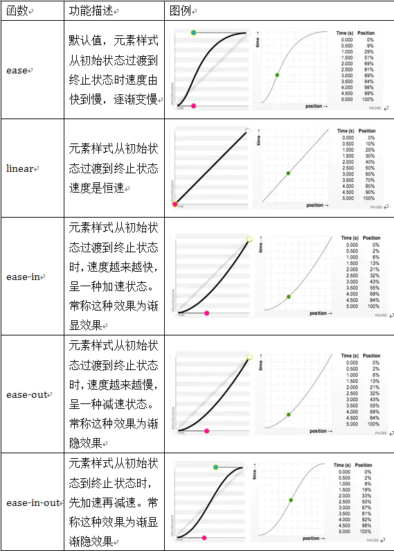

# 游览器渲染原理

## 游览器如何渲染网页
概述：浏览器渲染一共有五步
1. 处理`HTML`并构建`DOM`树。
2. 处理`CSS`构建`CSSOM`树。
3. 将`DOM`与`CSSOM`合并成一个渲染树。
4. 根据渲染树来布局，计算每个节点的位置。
5. 调用`GPU`绘制，合成图层，显示在屏幕上（第四步和第五步是最耗时的部分，这两步合起来，就是我们通常所说的渲染）

渲染
* 在网页生成的时候，至少会渲染一次
* 在用户访问的过程中，还会不断重新渲染
* 在构建`CSSOM`树时，会阻塞渲染，直至`CSSOM`树构建完成。并且构建`CSSOM`树是一个十分消耗性能的过程，所以应该尽量保证层级扁平，减少过度层叠，越是具体的`css`选择器，执行速度越慢
* 当`HTML`解析到`script`标签时，会暂停构建`DOM`，完成后才会从暂停的地方重新开始。也就是说，如果你想首屏渲染的越快，就越不应该在首屏就加载`js`文件。并且`CSS`也会影响`JS`的执行，只有当解析完样式表才会执行`JS`，所以也可以认为在这种情况下，`css`也会暂停构建`DOM`

## 游览器渲染五个阶段

### 第一步：解析HTML标签，构建DOM树
在这个阶段，引擎开始解析HTML，解析出来的结果会成为一颗dom树，dom的目的至少有2个
* 作为下个阶段渲染树状图的输入
* 成为网页和脚本的交互界面。（最常用的就是`getElementById0`等等）
#### 当解析器到达script标签的时候，发生下面四件事情
1. `html`解析器停止解析
2. 如果是外部脚本，就从外部网络获取脚本代码
3. 将控制权交给`js`引擎，执行`js`代码
4. 恢复`html`解析器的控制权
   由此可以得出结论
* 由于`script`标签是阻塞解析的，将脚本放在网页尾部会加速代码渲染。
* `defer`和`async`属性也能有助于加载外部脚本。
* `defer`使得脚本会在`dom`完整构建之后执行。
* `async`标签使得脚本只有在完全`available`才执行，并且是以非阻塞的方式进行的

### 第二步：解析CSS标签，构建CSSOM树
* 我们已经看到`html`解析器碰到脚本后会做的事情，接下来我们看下`html`解析器碰到样式表会发生的情况
* `js`会阻塞解析，因为它会修改文档(`document`)，`css`不会修改文档的结构，如果这样的话。似乎看起来`css`样式不会阻塞浏览器`html`解析，但是事实上`css`样式表是阻塞的。阻塞是指当`CSSOM`树建立好之后才会进行下一步的解析渲染
#### 通过以下手段可以减轻CSSOM带来的影响
* 将`script`脚本放在页面底部
* 尽可能快的加载`css`样式表
* 将样式表按照`media type`和`media query`区分，这样有助于我们将`css`资源标记成非阻塞渲染的资源。
* 非阻塞的资源还是会被浏览器下载，只是优先级较低

### 第三步：把DOM和CSSOM组合成渲染树


### 第四步：在渲染树的基础上进行布局，计算每个节点的几何结构
布局(`layout`)：定位坐标和大小，是否换行，各种`position`，`overflow`，`z-index`属性

### 第五步：调用GPU绘制，合成图层，显示在屏幕上
将渲染树的各个节点绘制到屏幕上，这一步被称为绘制`painting`

# CSS动画之transform

四个常用功能
* 位移 `transform`
* 缩放 `scale`
* 旋转 `rotate`
* 倾斜 `skew`
注：一般都需要配合transition过度  inline元素不支持transform，需要先变成block

transform之translate
```css
translateX(<length-percentage>)
translateY(<length-percentage>)
translate(<length-percentage>,<length-percentage>?)
translateZ(<length>)且父容器perspective
translate3d(x,y,z)
```
注：translate(-50%,-50%)可做绝对定位元素的居中

transform之scale
```css
scaleX(<number>)
scaleY(<number>)
scale(<number>,<number>?)
```

transform之rotate
```css
rotate([<angle> | <zero>])
rotateZ([<angle> | <zero>])
rotateX([<angle> | <zero>])
rotateY([<angle> | <zero>])
```
注：一般用于360°旋转制作loading

transform之skew
```css
skewX([<angel> | <zero>])
skewY([<angel> | <zero>])
skew([<angel> | <zero>],[<angel> | <zero>]?)
```
transform多重效果
```css
transform:scale(0.5) transform(-100%,-100%);
transform:none;取消所有
```

# CSS动画之transition

作用：补充中间帧

### 语法
* `transition`:属性名 时长 过渡方式 延迟
* `transition`：left 200ms linear
* 可以用逗号分隔两个不同属性
* `transition`：left 200ms,top 400ms
* 可以用all代表所有属性
* `transition`：all 200ms;
* 过渡方式有：linear | ease | ease-in | ease-out | ease-in-out | cubic-bezier | step-start | step-end | steps
注意：并不是所有属性都能过渡

### 过渡必须要有起始
一般只有一次动画，或者两次：比如hover和非hover状态的过渡

### 如果除了起始，还有中间点
两种方法
* 使用两次transform
* .a===transform===>.b
* .b===transform===>.c
* 如何知道到了中间点呢？答：用setTimeout或者监听transitionend事件

* 使用animation
* 声明关键帧
* 添加动画
* 如何让动画停在最后一帧？ 答：加个forwards

### @keyframes 完整语法
```css
@keyframes slidein {
  from {
    transform: translateX(0%);
  }

  to {
    transform: translateX(100%);
  }
}
```
```css
@keyframes identifier {
  0% { top: 0; left: 0; }
  30% { top: 50px; }
  68%, 72% { left: 50px; }
  100% { top: 100px; left: 100%; }
}
```

### animation

```
animation: [name/动画名称] [duration/动画时间] [timing-function/动画周期(ease)] delay[动画延时] [iteration-count/动画播放次数] [direction/指定是否应该轮流反向播放动画] [fill-mode/规定当动画不播放时（当动画完成时，或当动画有一个延迟未开始播放时），要应用到元素的样式] [play-state/指定动画是否正在运行或已暂停];
```

#### 设置动画播放方式
语法规则：
```css
animation-timing-function:ease(由快到慢，逐渐变慢) | linear | ease-in | ease-out | ease-in-out | cubic-bezier(<number>, <number>, <number>, <number>) [, ease | linear | ease-in | ease-out | ease-in-out | cubic-bezier(<number>, <number>, <number>, <number>)]*
```


#### 设置动画播放方向
animation-direction属性主要用来设置动画播放方向，语法规则如下：
```css
animation-direction:normal | alternate [, normal | alternate]*
```
其主要有两个值：`normal`、`alternate`
* `normal`是默认值，如果设置为noamal时，动画的每次循环都是向前播放；
* 另一个值是`alternate`，它的作用是，动画播放在第偶数次向前播放，第奇数次向反方向播放。

#### 设置动画的播放状态
animation-play-state属性主要用来控住元素动画的播放状态。
参数：
* 其主要有两个值：`running`和`paused`。
* 其中`running`是默认值，主要作用就是类似于音乐播放器一样，可以通过`paused`将正在播放的动画停下来，也可以通过`running`将暂停的动画重新播放，这里的重新播放不一定是从元素动画的开始播放，而是从暂停的那个位置开始播放。另外如果暂停了动画的播放，元素的样式将回到最原始的设置状态。
```css
animation-play-state:paused;
```
#### 设置动画时间外属性
* `animation-fill-mode`属性定义在动画开始之前和结束之后发生的操作。主要具有四个属性值：`none`，`forwards`，`backwords`和`both`。其四个属性值对应效果如下：
* none | 默认值，表示动画将按预期进行和结束，在动画完成其最后一帧时，动画会反转到初始帧处
* forwards | 表示动画在结束后继续应用最后的关键帧的位置
* backwards | 会在向元素应用动画样式时迅速应用动画的初始帧
* both | 元素动画同时具有forwards和backwards效果