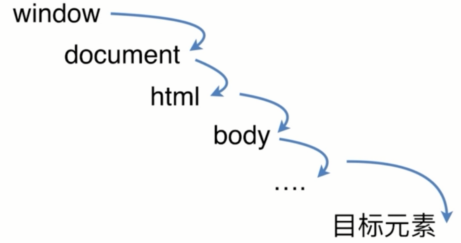
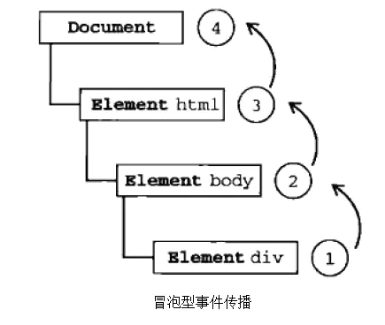

# DOM 事件机制

## DOM 事件模型
DOM 事件模型分为捕获和冒泡。一个事件发生后，会在子元素和父元素之间传播

**捕获阶段**：事件从 window 对象自上而下向目标节点传播的阶段


**冒泡阶段**: 事件从目标节点自下而上的向 window 对象传播的阶段


开发者可以自己选择函数放在捕获阶段或者冒泡阶段，如果 bool 的值为 false 或者不填，则默认浏览器在冒泡阶段调用 fn，如果是 true 则在捕获阶段调用 fn.

## target, currenTarget 和取消冒泡

e.target 是被用户操作的元素，而 e.currenTarget 是开发者监听的元素
```html
    <div>
	<span> 文字 </span>
    </div>
```
如果用户点击了文字，那么 e.target 就是 span，e.currenTarget 就是 div。

### 取消冒泡

捕获不可取消，但是冒泡可以
```javascript
    e.stopPropagation() // 用于中断冒泡
```

## 事件委托
由于事件会在冒泡阶段向上传播到父节点，因此可以把子节点的监听函数定义到父节点上，由父节点的监听函数统一处理多个子元素的事件。这种方法叫做**事件的委托**。委托其他元素监听需要监听的元素。

事件委托的优点是：省监听数(内存)，可以监听动态元素
举例1(给多个按钮添加点击事件)
```html
    <div id='div1'>
    <button> 1 </button>
    <button> 2 </button>
    <button> 3 </button>
    <button> 4 </button>
    <button> 5 </button>
    </div>
```
```javascript
    div1.addEventListener('click',(e)=>{ // 给 div1 添加点击事件
	const t = e.target // 被操作的元素（button）赋值为 变量t
    if(t.tagName.toLowerCase()==='button'){ // 如果 t 的标签名的小写全等于 button，那么执行函数
    	console.log('button 被点击了')
    }
}
```
上述的例子，如果直接给 button 添加点击事件需要 5 个监听器，而如果给div1添加点击事件，只需要 1 个监听器，节约了内存
举例2(监听目前不存在的元素)
```javascript
    setTimeout(()=>{ 
	const button = document.createElement('button')
    button.textContent = 'click 1'
    div1.appendChild(button)
    },1000)

    div1.addEventListener('click',(e)=>{ // 给 div1 添加点击事件
    const t = e.target  // 将被操作的元素（button，目前不存在）赋值给变量t
    if(t.tagName.toLowerCase()==='button'){ // 如果 t 的标签名的小写全等于 button，那么执行函数
    console.log('button 被点击了')
    }
    })
```
上述的例子中，`click 1`这个 button 是在一秒后生成的，但是使用事件委托，将事件挂在 div1 上，仍然可以获取到这个 button ，因此事件委托可以用来监听目前不存在的元素。