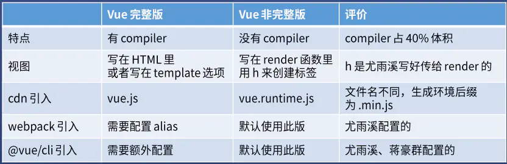
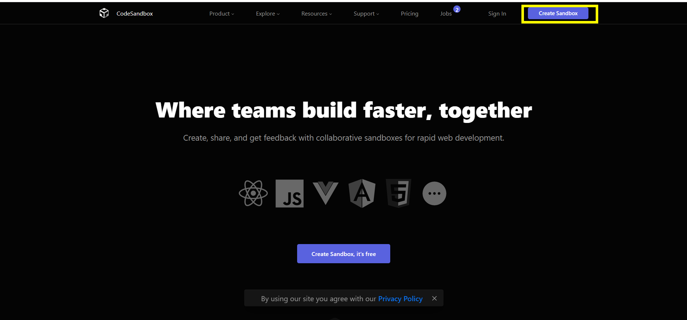
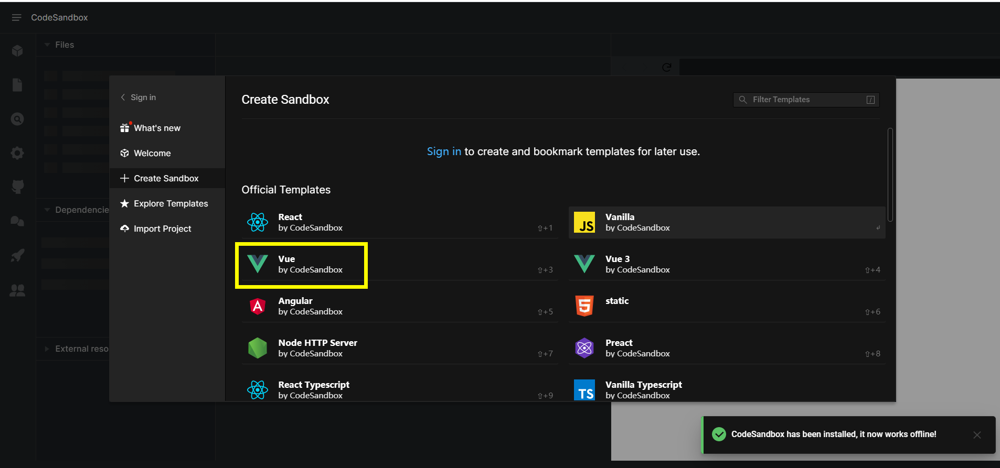
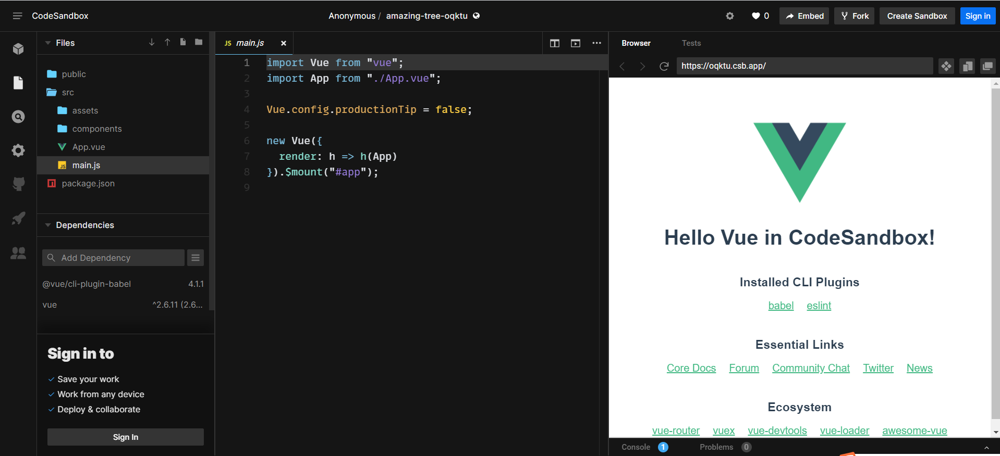

# Vue 两个版本的区别和使用方法

## 两个版本对应的文件名

vue.js (完整版) vue.runtime.js (非完整版)

## 两者区别



- 总是使用非完整版，配合 vue-loader 和 vue 文件

1. 保证用户体验，用户下载的 js 文件体积更小，但**只支持 h 函数**
2. 保证开发体验，开发者可直接在 vue 文件里写 HTML 标签，而**不写 h 函数**
3. 脏活 loader 做，vue-loader 把 vue 文件里的 HTML **转化为 h 函数**

如果 vue.js 错用成 vue.runtime.js:无法将 HTML 编译成视图
如果 vue.runtime.js 错用成 vue.js:代码体积变大，因为 vue.js 有编译 HTML 的功能

## template 和 render 怎么用

vue 完整版 template 的使用方法

```javascript
new Vue({
  el: "#app",
  template: `
    <div @click="add">{{n}} <button>+1</button></div>
  `,
  data: {
    n: 0,
  },
  methods: {
    add() {
      this.n += 1;
    },
  },
});
```

vue 非完整版 render 的使用方法：

```javascript
new Vue({
  el: "#app",
  render(h) {
    return h("div", [this.n, h("button", { on: { click: this.add } }, "+1")]);
  },
  data: {
    n: 0,
  },
  methods: {
    add() {
      this.n += 1;
    },
  },
});
```

## 如何使用 codesandbox.io 写 Vue 代码

- 第一步：打开 [codesandbox.io](https://codesandbox.io/).不需要登录(登录之后只能创建 50 个项目)，然后创建一个新的 vue 项目即可
  

- 第二步：选择 Vue 项目
  

- 第三步：进行对 Vue 的相关操作
  

- 第四步：点击 File 下的 Export to ZIP,导出到你想要存储的文件夹
