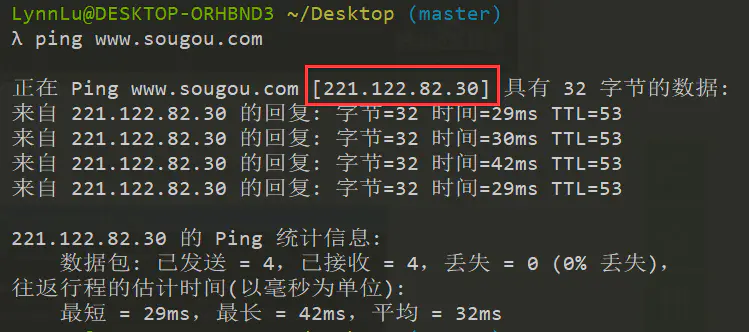

# URL包含哪几部分，每部分的作用
`url = 协议 + 域名或ip + 端口号 + 路径 + 查询参数 + 锚点`
`http://www.example.com:80/path/to/myfile.html?key1=value1&key2=value2#SomewhereInTheDocument`

## 协议
`http://`
* 协议是用来完成客户端和服务端之间数据传输的;

## 域名
`www.example.com`
* 用于解析对应的IP地址，便于记忆
* com是顶级域名
* xxx.com是二级域名(俗称一级域名)
* www.xxx.com是三级域名(俗称二级)
* 他们是父子关系

## 端口
`:80`
* 表示用于访问Web服务器上的资源的技术“门”。
* 一台服务器的端口号取值范围在0-65535之间
* http默认端口80
* https默认端口443
* ftp默认端口21

## 路径
`/path/to/myfile.html`
* 是网络服务器上资源的路径。在Web的早期阶段，像这样的路径表示Web服务器上的物理文件位置。

## 查询参数
`?key1=value1&key2=value2`
* 就是查询参数。这些参数用&符文分隔的键值对。每个Web服务器都有自己关于参数的规则。

## 锚点
`#SomewhereInTheDocument`
* 锚点是网页制作中超级链接的一种，又叫命名锚记，像一个迅速定位器一样，是一种页面内的超级链接
* 在文档中设置标记，这些标记通常放在文档的特定主题处或顶部。然后可以创建到这些命名锚记的链接，这些链接可快速将访问者带到指定位置

# DNS的作用
* DNS是域名系统(Domain Name System)，它是由解析器和域名服务器组成的。域名服务器是保存有该网络中所有主机的域名和对应IP地址，并将域名转换为IP地址。有了DNS服务器。就不用输入IP地址来访问一个网站，而是可以通过输入网址访问。
  
# nslookup命令

# IP的作用
* IP的作用是定位一台设备，封装数据报文以与其他设备交流。使用ping命令查看IP地址，输入PING+域名
## ping命令

# 域名是什么，分别哪几种域名
* 域名(Domain names)是互联网架构的关键部分。任何连上互联网的电脑都可以通过一个公共IP地址访问到。
## 域名的分类
1. 类别域名(国际域名)共有七个。`com`(商业公司)、`net`(网络服务)、`org`(组织协会)、`gov`(政府部门)、`edu`(教育机构)、`mil`(军事领域)、`int`(国际组织)。
2. 国家顶级域名，共有200多个国家和地区的代码，例如CN代表中国，UK代表英国。